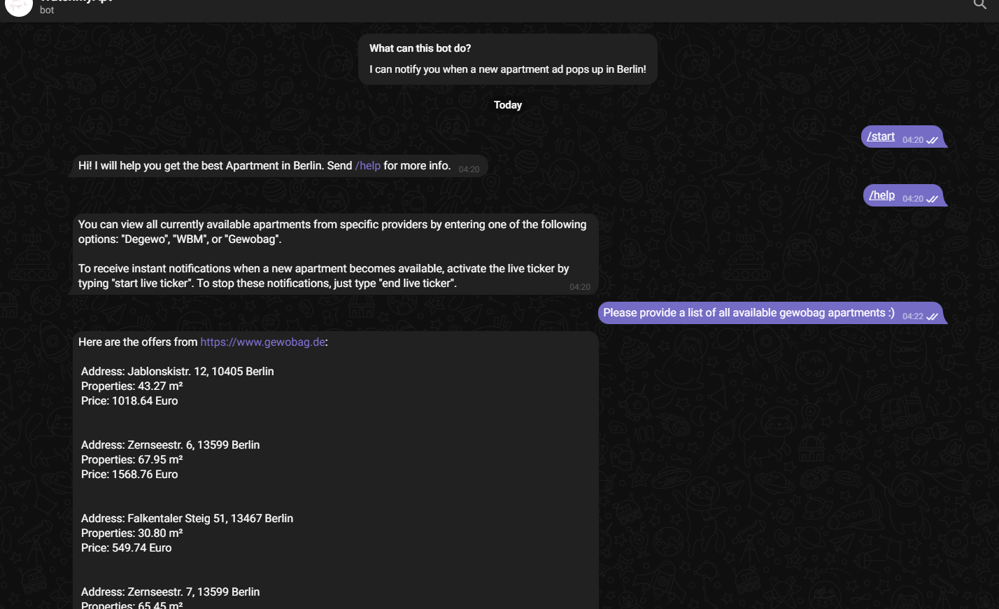

# WatchMyAptBerlin - Berlin Apartment Finder

**WatchMyAptBerlin** is a powerful tool designed to help users quickly discover available apartments for rent in Berlin. The software continuously monitors apartment listings and sends real-time notifications via a Telegram bot, so you never miss an opportunity to apply for a new rental. Whether you're actively searching for a new home or just want to stay updated, **APP** streamlines the process, ensuring you're always one step ahead in the competitive Berlin rental market.

### Key Features

- **Real-Time Notifications:** Receive instant updates when new apartments are listed for rent in Berlin.
- **Telegram Bot Integration:** Get notified via Telegram so you can react quickly and apply for apartments.
- **Apartment Listings:** Get all the apartment listings currently available on the market.

  
### Preview

   
### Installation

To get started with **WatchMyAptBerlin**, follow these steps:

1. **Clone the repository:**

   ```bash
   git clone https://github.com/thangixd/WatchMyAptBerlin.git
   cd WatchMyAptBerlin
   ```

2. **Install dependencies:**

   Install the required Python packages by running the following command:

   ```bash
   pip install -r requirements.txt
   ```

3. **Set up your Telegram Bot:**

   If you want to receive notifications through Telegram, you will need to create your own bot. Follow these steps to set up your bot:
   
   - Create a Telegram bot by talking to the [BotFather](https://core.telegram.org/bots#botfather) on Telegram.
   - Get your bot token from BotFather.
   - Set the bot token in your environment variables under `TELEGRAM_BOT_TOKEN`.


4. **Run the Application:**

   - To start the real-time apartment watcher with Telegram notifications, run:

     ```bash
     python WatchMyAPT_bot.py
     ```
      Go to your Telegram bot and type "/help".
   - If you don't need the Telegram bot and want to run the application without notifications, simply run the main application:

     ```bash
     python main.py
     ```

### Proxy Support

If you need to use a proxy, you can easily configure it in the modules/scraper.py file. By default, proxy usage is disabled.

### Customization

You have the option to tweak certain parameters in the code, including the frequency of checks, the type of apartments you're looking for, and more. Feel free to explore the code to tailor it to your needs.

### Contributing

If you'd like to contribute to the project, please fork the repository and create a pull request. Feel free to submit issues or suggestions for improvement.
